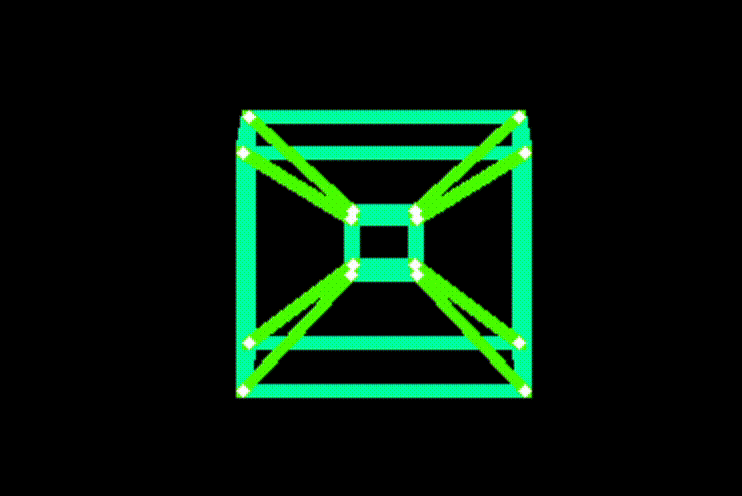

# VGA Black Hole Demoscene (TinyTapeout)

## Overview

This design is a VGA demoscene that renders a stylized black hole, inspired by Interstellar’s Gargantua, on a 640×480 display using the TinyTapeout harness. The top-level module `tt_um_vga_example` generates standard 640×480@60 Hz timing with a small `hvsync_generator`, recenters the visible pixel coordinates around the screen midpoint, and then evaluates geometric predicates per pixel to decide what to draw.

The image is composed of layered elements:

- A circular **shadow** (event horizon) in the center.
- A flattened **accretion disk** (“belt”) that wraps around the shadow.
- A softer outer **halo** representing lensed background light.
- A falling **“UW”** logo that animates vertically and respects occlusion by the shadow and disk.

All of the effects are implemented with fixed-point integer arithmetic: squared distances (to avoid square roots), bit-shifts for aspect squashing, and simple bit-based “texture” patterns driven by the frame counter. The design fits within a single TinyTapeout tile while still providing a continuous, looping animation.

---

## Key design points and challenges

### 1. Initial 4D tesseract visualizer (abandoned)

The original concept was a 4D tesseract (hypercube) visualizer that would rotate a hypercube in real-time and project it onto the 2D VGA screen:

- Targeted **64 frames per second**.
- For each frame, we needed to transform and project **16 vertices** from 4D → 3D → 2D.
- This required:
  - **sin/cos lookup tables (LUTs)** for rotation.
  - A small matrix/vector pipeline to perform the 4D rotation and projection.
  - **Line-drawing logic** to connect vertices within each frame.

Synthesis on sky130 showed this was far beyond the TinyTapeout area budget:

- Full dynamic version (rotation + edges per frame): about **4200 %** utilization.
- After dropping the explicit line-drawing and only projecting vertices: still around **1800 %**.
- We then tried a **precomputed-frame approach**:
  - A Python script generated the projected coordinates for a given tesseract rotation.
  - The chip would store and look up these precomputed frames instead of computing trig on-chip.
- Even with precomputed data, utilization remained too high because of the amount of stored geometry and associated control logic.
- Finally, reducing from **64 frames down to 16 frames** brought utilization within the limit, but the animation became visibly choppy and lost the “wow” factor.

After discussing this with our instructor, the conclusion was that a fully dynamic 4D tesseract (with decent visual quality) is not realistic for a single TinyTapeout tile. This drove the decision to pivot toward a more area-efficient but still visually interesting design.

### 2. Pivot to a black hole demoscene

We looked for a concept that:

- Still felt visually striking.
- Could be expressed using **simple algebraic geometry** instead of trig.
- Reused the VGA skeleton but relied mostly on:
  - Squared distances (radial metrics).
  - Bit-shifts and comparisons.
  - Lightweight animation based on counters.

The black hole demoscene fits this nicely:

- Replace trig with squared radii and ellipses.
- Use a few **radius thresholds** to define concentric regions (shadow, disk, halo).
- Use **bit patterns** derived from `(radius − frame_cnt)` to create moving rings.
- Animate a single object (the “UW” logo) using just a frame counter and coordinate checks.

### 3. Black hole geometry and layering

The visual core is a “geometry engine” built from integer math:

- Recenter pixel coordinates so that (320, 240) → (0, 0):
  - `dx = x_px − 320`
  - `dy = y_px − 240`
- Compute squared distances:
  - `dx_sq = dx * dx`
  - `dy_sq = dy * dy`
- Define two metrics:
  - **Circular radius** for shadow and halo:  
    `r2_circ = dx_sq + dy_sq`
  - **Flattened radius** for the accretion disk (y squashed by 4×):  
    `r2_flat = dx_sq + (dy_sq << 4)`  
    (equivalent to `dx² + 16·dy²`)

We then classify each pixel by comparing against thresholds:

- **Shadow (event horizon):**  
  `in_shadow = (r2_circ < SHADOW_R2)`
- **Accretion disk (belt):**  
  `in_belt = (BELT_IN_R2 ≤ r2_flat ≤ BELT_OUT_R2)`
- **Halo:**  
  `in_halo = (HALO_IN_R2 ≤ r2_circ ≤ HALO_OUT_R2)`

A simple sign check creates a depth effect:

- `belt_is_in_front = (dy > 4);`  
  This makes the bottom half of the belt appear in front of the black hole and the top half appear behind it.

### 4. Procedural textures and color scheme

Instead of stored textures, we use a small arithmetic “texture generator”:

- For the disk (belt):
  - `belt_tex_val = r2_flat[15:8] − frame_cnt[7:0];`
- For the halo:
  - `halo_tex_val = r2_circ[13:6] − frame_cnt[7:0];`

Individual bits are used as pattern switches:

- `belt_gap = belt_tex_val[4];` → enables thin darker gaps.
- `belt_yellow = belt_tex_val[2];` → toggles between red and yellow/orange.
- `halo_gap` / `halo_yellow` are used similarly for the halo.

This produces concentric, moving rings. As `frame_cnt` increments, the apparent phase of the pattern shifts, giving an illusion of rotation or flowing plasma without any explicit angle calculations.

Colors are encoded on 2-bit R/G/B:

- **Bright yellow/orange:** `R=11`, `G=10`, `B=00`
- **Bright red:** `R=11`, `G=00`, `B=00`
- **Very dim red (gaps):** `R=01`, `G=00`, `B=00`
- **Shadow (event horizon):** `R=00`, `G=00`, `B=00`
- **“UW” text:** `R=11`, `G=11`, `B=11` (white)

### 5. UW text animation and occlusion

The “UW” logo is drawn as a bitmap-style shape directly from `(x_px, y_px)` ranges:

- A 16-bit `frame_cnt` increments on each VSYNC.
- Animation uses `frame_cnt[8]`:
  - If `frame_cnt[8] == 0`:
    - `text_y_pos = 20;` → logo hovers near the top.
  - If `frame_cnt[8] == 1`:
    - `text_y_pos = 20 + frame_cnt[7:0];` → logo steadily falls down the screen.
- The vertical band for text is `y ∈ [text_y_pos, text_y_pos + 32)`.

Within that band:

- The **“U”** and **“W”** live in fixed x-ranges (centered horizontally).
- Simple conditions on relative x/y (e.g., “left bar”, “right bar”, “bottom row”, “central notch”) generate the strokes of each letter.

Occlusion / depth is handled entirely in the pixel-priority logic:

- The **shadow** has higher priority than text: once the “UW” logo falls into the black hole, it disappears behind the event horizon.
- The **front half of the belt** is drawn before the shadow, so it can also cover the text from below in some positions.
- This ordering creates a convincing pseudo-3D effect with just a handful of `if`/`else` conditions.

### 6. Area optimization and removed star field

We experimented with a star-field background:

- A pseudo-random star pattern using a hash like:  
  `((star_x * 433) ^ (star_y * 389)) * 251;`

This required multiple multipliers and significantly increased area:

- The design went from roughly **88 %** utilization to around **129 %**.
- To keep the core black hole geometry and text animation intact and meet TinyTapeout limits, the star field was removed from the final design.

---

## How it works

Black Hole Visualization on TinyTapeout renders a stylized black hole on a 640×480 VGA output using the Verilog top level `tt_um_vga_example`. The design consists of three main pieces:

1. **VGA timing core**

   The `hvsync_generator` module produces:

   - Horizontal and vertical counters: `hpos` (0–799), `vpos` (0–524).
   - Active-low sync signals: `hsync`, `vsync`.
   - A `display_on` flag that is high only when `(hpos < 640, vpos < 480)`.

   These signals are mapped out to the TinyVGA PMOD through:

   - 2-bit R/G/B registers `R`, `G`, `B`.
   - `uo_out = {hsync, B[0], G[0], R[0], vsync, B[1], G[1], R[1]}`.

2. **Geometry engine**

   For each visible pixel (`display_on == 1`):

   - Recenter coordinates:
     - `dx = x_px − 320;`
     - `dy = y_px − 240;`
   - Compute squared distances:
     - `dx_sq = dx * dx;`
     - `dy_sq = dy * dy;`
   - Define metrics:
     - Circular: `r2_circ = dx_sq + dy_sq;`
     - Flattened: `r2_flat = dx_sq + (dy_sq << 4);` // 16× vertical squashing

   Region flags:

   - `in_shadow = (r2_circ < SHADOW_R2);`
   - `in_belt   = (r2_flat >= BELT_IN_R2 && r2_flat <= BELT_OUT_R2);`
   - `in_halo   = (r2_circ >= HALO_IN_R2 && r2_circ <= HALO_OUT_R2);`
   - `belt_is_in_front = (dy > 4);`

3. **Animation and rendering**

   - A 16-bit `frame_cnt` increments once per VSYNC edge:
     - Used to drive:
       - `text_y_pos` (logo hovering vs falling).
       - `belt_tex_val` and `halo_tex_val` (moving ring patterns).
   - Texture bits (`gap`, `yellow`) select between black gaps, dim red, bright red, and yellow/orange.

   The final color is chosen in a fixed priority order:

   1. **Front belt (bottom half of disk)**  
      If `in_belt && belt_is_in_front`, color based on belt texture bits.

   2. **Shadow (event horizon)**  
      If `in_shadow`, force pixel to pure black (occludes text and back belt).

   3. **Text ("UW")**  
      If `draw_text`, draw white, but only if not shadowed (due to earlier checks).

   4. **Back belt (top half of disk)**  
      If `in_belt` but not front and not shadow/text, draw belt colors.

   5. **Halo (outer lensed light)**  
      If `in_halo`, draw based on halo texture bits.

   If none of these conditions hold, the pixel stays black, providing a deep-space background.

---

## How to test

1. **Online VGA playground**

   TinyTapeout provides an online VGA playground at  
   `https://vga-playground.com/` that can be used to quickly test the visualization without hardware:

   - Open `https://vga-playground.com/` in a browser.
   - Copy and paste the **entire contents of `project.v`** into the code section of the playground.
   - **Delete the `hvsync_generator` module definition** from the pasted code:
     - The playground already includes a built-in VGA timing generator, so only the `tt_um_vga_example` top-level and its rendering logic are needed.
   - Run/compile in the playground:
     - The site will drive the design with its own VGA timings and display the output.
     - You should see the black hole, accretion disk, halo, and the animated “UW” logo falling into the black hole.

2. **On-chip / hardware validation**

   - Connect `uo_out` through a TinyVGA-compatible PMOD to a VGA monitor:
     - Ensure the mapping `{hsync,B0,G0,R0,vsync,B1,G1,R1}` is respected.
   - Provide:
     - ~25 MHz pixel clock on `clk`.
     - Proper reset on `rst_n` via the TinyTapeout harness.
   - Power up and visually check:
     - Stable 640×480 image with no rolling/tearing.
     - Centered black circular shadow, flattened disk, and outer halo.
     - Moving ring patterns in the disk/halo over time.
     - “UW” logo:
       - Appears near the top for a while.
       - Falls downward, disappearing behind the black hole.
       - Repeats periodically as the frame counter wraps.

---

## External hardware

- VGA monitor or capture device.
- TinyVGA-compatible PMOD or equivalent breakout for RGB and sync signals.
- TinyTapeout carrier / harness providing:
  - ~25 MHz pixel clock.
  - Reset and power for the design.
